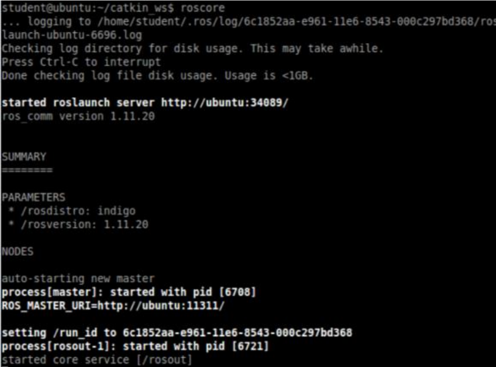

# Using genetic algorithms and evolutive neural networks to train a modile robot to pass labyrinth obstacles #

### This is a course project for Robotic Systems course (13M051RS) at the University of Belgrade, School of Electrical Engineering - Signal and Systems module ###

#### Authors: Jakša Jovičić and Ivan Prelić ####
#### School year: 2020-2021 First semester ####

The main idea of the project is to see if the evolutive neural networks concept can be applied to autonomous mobile robots and agents.

The project has been developed for **ROS** (**R**obot **O**perating **S**ystem) simulations. The set-up virtual machine version of Ubuntu 16.04 with ROS can be downloaded from the [link](https://mega.nz/file/N9YgRCCB#DNtGvdPdZBR1SGRbLVSa9arte2KkXurn-e0pbjTolwg). 
* The project has been developed in VMWare Workstation 15 Pro software
	* This host supports Intel VT-x, but Intel VT-x is disabled ERROR -> [solution](https://www.howtogeek.com/213795/how-to-enable-intel-vt-x-in-your-computers-bios-or-uefi-firmware/)
* credentials 
	* username: student
	* password: student
* Testing the system
	* Open a terminal
	* run gazebo command -> The program should start
	* Open a terminal
	* run roscore command -> The following output should appear

#### For the environment to run next steps need to be taken: ####
* run gedit ~/.bashrc -> inside the editor add next code block at the end of the file:
	* Set ROS Kinetic
	source /opt/ros/kinetic/setup.bashsource ~/catkin_ws/devel/setup.bash
	* Set ROS Network
	export ROS_HOSTNAME=localhost #if you use ROS only for simulation (no hardeware 
	or other computers)
	export ROS_MASTER_URI=http://${ROS_HOSTNAME}:11311
	* Set ROS alias command
	alias cw='cd ~/catkin_ws'
	alias cs='cd ~/catkin_ws/src'
	alias cm='cd ~/catkin_ws && catkin_make'
* run source ~/.bashrc -> applies the changes
* sudo apt-get install ros-kinetic-joy ros-kinetic-teleop-twist-joy ros-kinetic-teleop-twist-keyboard ros-kinetic-laser-proc ros-kinetic-rgbd-launch ros-kinetic-depthimage-to-laserscan ros-kinetic-rosserial-arduino ros-kinetic-rosserial-python ros-kinetic-rosserial-server ros-kinetic-rosserial-client ros-kinetic-rosserial-msgs ros-kinetic-amcl ros-kinetic-map-server ros-kinetic-move-base ros-kinetic-urdf ros-kinetic-xacro ros-kinetic-compressed-image-transport ros-kinetic-rqt-image-view ros-kinetic-gmapping ros-kinetic-navigation

* cd ~/catkin_ws/src/
* git clone https://github.com/ROBOTIS-GIT/turtlebot3.git
* git clone https://github.com/ROBOTIS-GIT/turtlebot3_msgs.git
* git clone https://github.com/ROBOTIS-GIT/turtlebot3_simulations.git
* cd ~/catkin_ws && catkin_make

#### Project installation ####
* Clone the repository to the catkin_ws directory (can be accesed with cs command if all is set-up)
* run cm in terminal to make the project

#### To run the ros environment with the project: ####

* open a terminal and run roscore -> this terminal needs to be open while any ros program runs
* open a terminal and run:
	* export TURTLEBOT3_MODEL=burger
	* roslaunch turtlebot3_gazebo turtlebot3_world.launch
* open a terminal and run rosrun <name-of-project> control_node.py